# Object Detection in Urban Environments

## Download the dataset
Run the following command to download the Waymo Open Dataset:

` python download_process.py --data_dir data/waymo/ --temp_dir data/tmp/ `

Then split up the dataset into training, testing, and validation

## Exploratory Data Analysis:
The dataset consists of cars, pedestrians, and cyclists. It included images from day and night, and from close and far range.
The images and their corresponding bounding box labels look as follows:
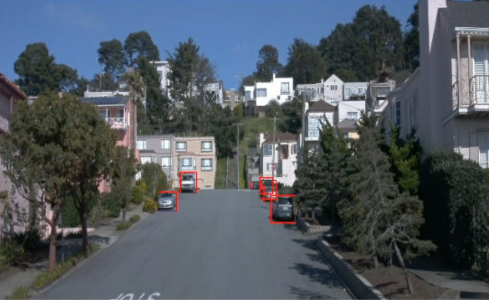
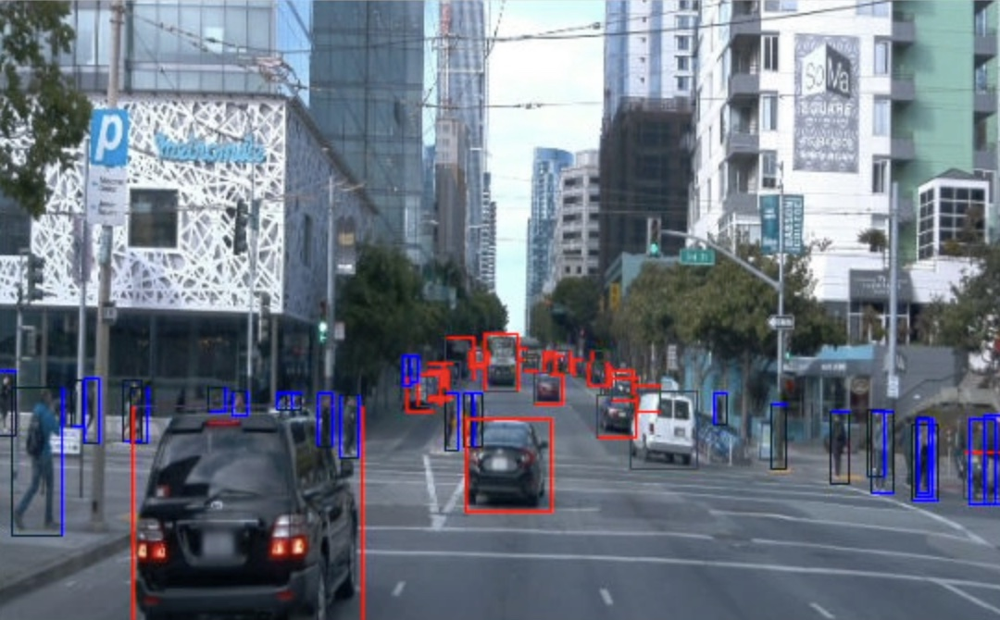
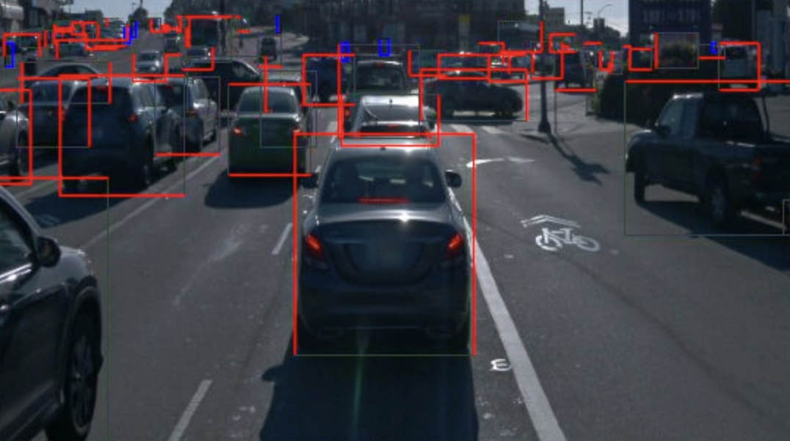
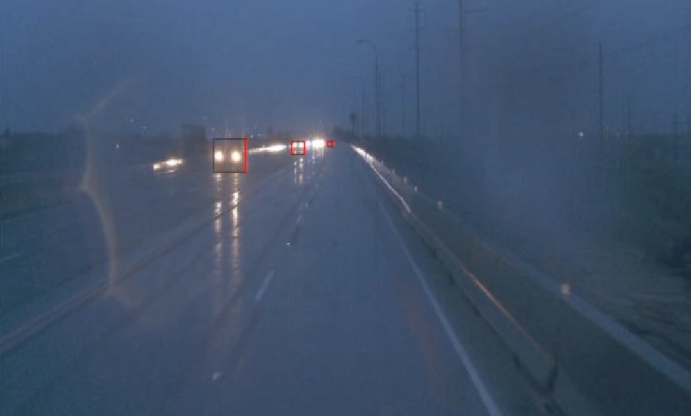

### The distribution of labels is as follows:
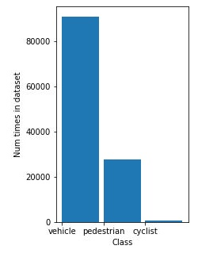

## Cross Validation
Because we want to analyze the effectiveness of our hyperparameters while training, we need to set up a validation set. I implemented an 80/20 split of my dataset for training and validation.

## Training
### Training Problems I Encountered
Initially, I tried training on the default values given in the pipeline.config. However, it seemed that the model overfit the data, and so I needed to increase the generalizability of the model by tweaking the dataset and hyperparameters.

### Tensorboard Results
Here are the Tensorboard graphs for the trainings that I ran:

For a Resnet backbone, Adam optimizer, learning rate scheduler, with augmentations:
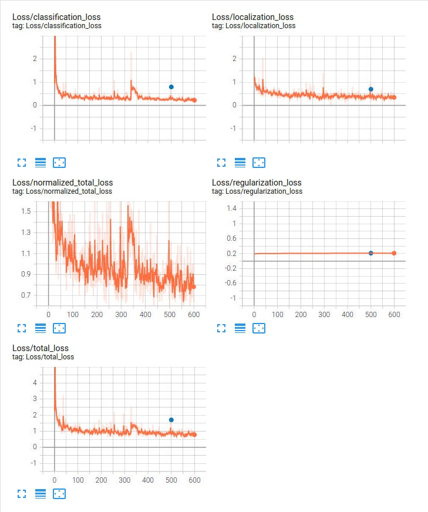

You can see that the training loss is converging to a loss around .7, and the validation loss is near it, at around 1.7. This means our model is not overfitting and is generalizing well to the overall dataset. It is expected that the training loss decreases because that is what the stochastic gradient descent algorithm is meant to do.

For the EfficientDet backbone, Adam optimizer, learning rate scheduler, with augmentations :
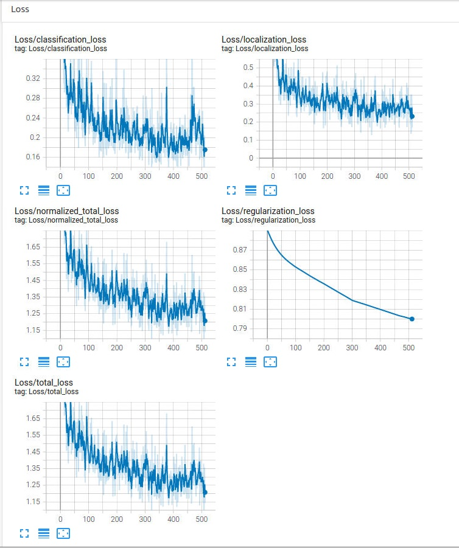
Here, the model is converging to a lower loss, however it does not reach as good of a performance as the Resnet backbone

Learning rate scheduler visualization:
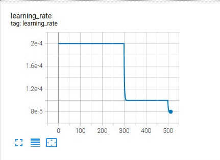

## Model Improvement Specifics
I changed the optimizer from a momentum optimizer to adam, and I scheduled that the learning rate decrease after every 300 epochs so that the model is less likely to overfit. I also cut the starting learning rate in half because I wanted to prevent overfitting.
Here is the change in the config file:
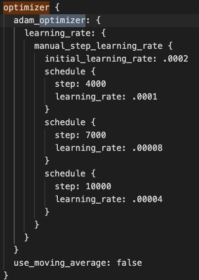

I attempting to change the model backbone to the EfficientDet architecture, however I found that the performance was better with the Resnet that was recommend in the pipeline in the first place

I also added two augmentations to the dataset, including brightening/darkening the image and scaling the images. The darkening has the effect of simulating a low visiblity environment (like at night or during fog) and the scaling allows the model to see more sizes of cars.
Here is the change in the config file:
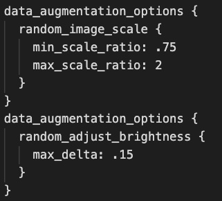

See the effect that the aformentioned two augmentations have on an image:

No augmentation:

Darkened:
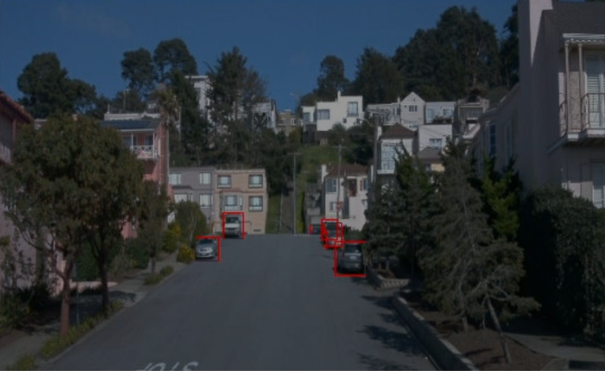

Scaled:
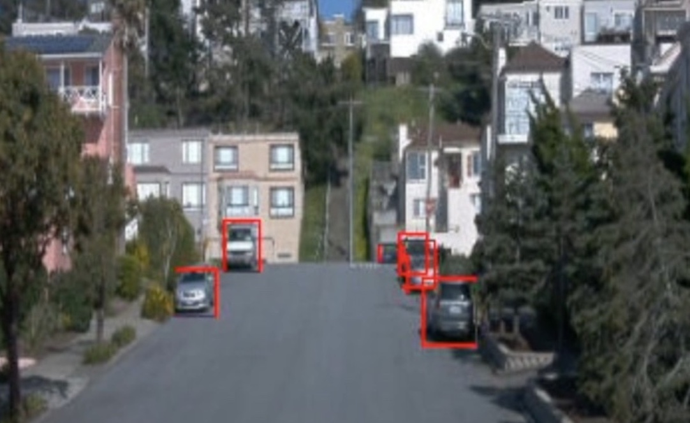

